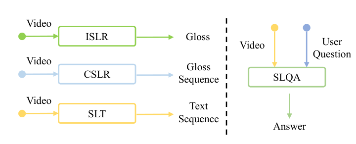
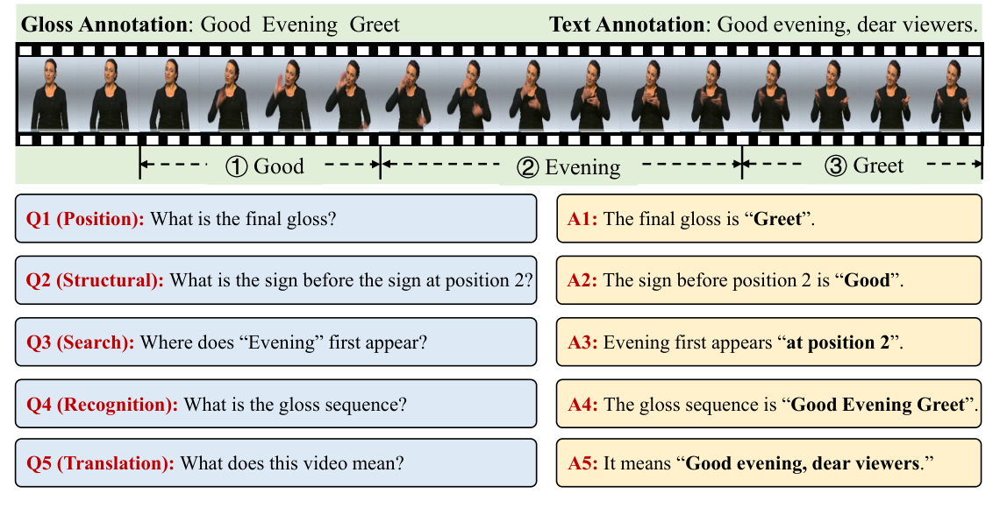
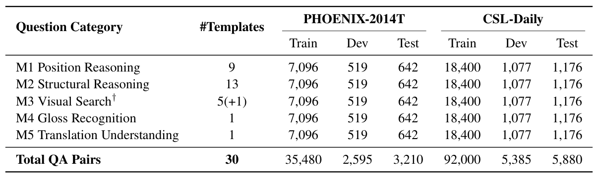
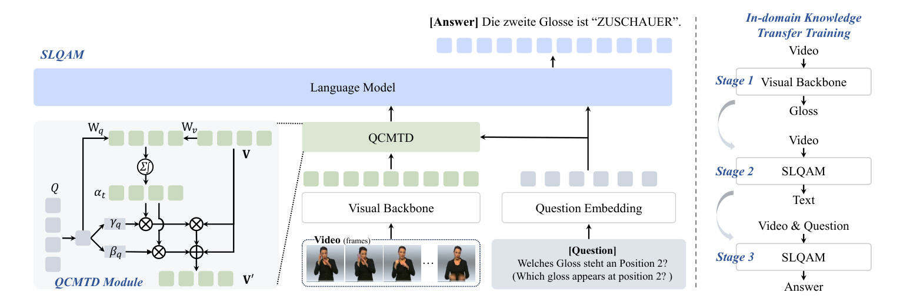

<div align="center">

# Sign Language Question Answering

### A New Task, Benchmark, and Baseline for Sign Language Understanding

[**Shiwei Gan**](https://scholar.google.com/citations?user=qXmzwiQAAAAJ)<sup>\*</sup>,
**Lichen Wang**<sup>\*</sup>,
**Xiao Liu**,
**Yafeng Yin**<sup>†</sup>,
**Kuizhuang Liu**,
**Sanglu Lu**,
**Lei Xie**

Nanjing University

<sup>\*</sup> Equal contribution &nbsp;&nbsp; <sup>†</sup> Corresponding author

[](https://arxiv.org/abs/2607.27826)
[](https://huggingface.co/datasets/hulala/SignQA-2026)
[](#-todo)
[](https://github.com/gswycf/SignLanguageQA)

[[Paper PDF]](paper/2607.27826v1.pdf) &nbsp; [[arXiv]](https://arxiv.org/abs/2607.27826) &nbsp; [[Dataset]](https://huggingface.co/datasets/hulala/SignQA-2026)

</div>

<p align="center">
  
</p>

<p align="center"><em>
From fixed video-to-label mappings to flexible, question-driven sign language understanding.
</em></p>

## 🔥 News

- **2026-08-20:** Project page and paper PDF released.
- **2026-07-30:** SignQA-2026 annotations released on Hugging Face.
- **2026-07-30:** Paper released on arXiv.

## 📖 Overview

Existing sign language understanding tasks usually learn a fixed mapping from a
video to a sign class, gloss sequence, or spoken-language translation. These
objectives reveal only part of what a model understands and cannot flexibly
respond to different user questions about the same video.

We introduce **Sign Language Question Answering (SLQA)**: given a sign video and
a natural-language question, a model must generate the corresponding answer.
SLQA evaluates fine-grained visual retrieval, temporal and structural reasoning,
gloss recognition, and sentence-level semantic understanding in one unified
framework.

| 🧩 New Task | 📊 New Benchmark | 🚀 Strong Baseline |
| --- | --- | --- |
| The first SLQA formulation for answering diverse questions grounded directly in sign videos. | Two multilingual SignQA benchmarks with **144,550 QA pairs** over **28,910 videos**. | **SLQAM**, featuring question-conditioned temporal downsampling and in-domain knowledge transfer. |

## 🎯 SignQA Benchmark

SignQA-2026 is constructed from the gloss and translation annotations of
**PHOENIX-2014T** and **CSL-Daily**. It covers five complementary question
categories, ranging from low-level sequence reasoning to high-level language
understanding.

<p align="center">
  
</p>

1. **M1 - Position Reasoning:** identify a gloss at a specified position.
2. **M2 - Structural Reasoning:** reason about neighboring signs and subsequences.
3. **M3 - Visual Search:** locate a target gloss or identify non-manual markers.
4. **M4 - Gloss Recognition:** recover the complete gloss sequence.
5. **M5 - Translation Understanding:** understand the spoken-language meaning.

### Dataset statistics

<p align="center">
  
</p>

| Benchmark | Language | Train | Dev | Test | Total |
| --- | --- | ---: | ---: | ---: | ---: |
| PHOENIX-2014T-QA | German | 35,480 | 2,595 | 3,210 | 41,285 |
| CSL-Daily-QA | Chinese | 92,000 | 5,385 | 5,880 | 103,265 |
| **Total** | - | **127,480** | **7,980** | **9,090** | **144,550** |

> [!NOTE]
> The Hugging Face release contains QA annotations and video identifiers. Source
> videos are not redistributed. Please obtain PHOENIX-2014T and CSL-Daily
> separately and follow their original access and license terms.

## 🏗️ SLQAM

Our baseline, **SLQAM (Sign2Answer)**, contains three major components:

- a visual backbone for frame-level sign representations;
- **Question-Conditioned Modulated Temporal Downsampling (QCMTD)** for selecting
  question-relevant temporal information;
- a language model for answer generation.

We further introduce a three-stage in-domain knowledge transfer pipeline:
**CSLR pre-training → SLT training → SLQA fine-tuning**. This progressively
transfers sign perception, temporal alignment, and language generation knowledge
to the new SLQA task.

<p align="center">
  
</p>

## 📈 Main Results

SLQAM consistently outperforms general-purpose video-language models and the
cascaded Sign2Text2Answer baseline on both benchmarks. The table below reports
overall **test-set** results from the paper.

| Model | PHOENIX RL ↑ | PHOENIX BLEURT ↑ | PHOENIX CIDEr ↑ | CSL-Daily RL ↑ | CSL-Daily BLEURT ↑ | CSL-Daily CIDEr ↑ |
| --- | ---: | ---: | ---: | ---: | ---: | ---: |
| VideoLLaMA3-2B | 44.69 | 37.45 | 1.252 | 60.51 | 38.24 | 1.735 |
| Qwen3-VL-2B-Instruct | 47.70 | 42.02 | 1.410 | 60.24 | 38.32 | 1.699 |
| InternVL3-2B | 50.93 | 45.45 | 1.736 | 64.27 | 44.31 | 2.277 |
| Sign2Text2Answer | 53.54 | 54.54 | 2.343 | 70.75 | 54.04 | 3.754 |
| **SLQAM (Sign2Answer)** | **54.16** | **56.21** | **2.768** | **73.52** | **60.23** | **4.193** |

> RL denotes ROUGE-L. Higher is better for all metrics shown. See Tables 5-8 in
> the paper for complete per-task and BLEU results.

## 🤗 Dataset

The annotations are available at
[hulala/SignQA-2026](https://huggingface.co/datasets/hulala/SignQA-2026).

```python
from datasets import load_dataset

# Chinese benchmark
csl_daily = load_dataset("hulala/SignQA-2026", "csl-daily-qa")

# German benchmark
phoenix14t = load_dataset("hulala/SignQA-2026", "phoenix14t-qa")
```

Each annotation contains the source `video_id`, split, dataset, module,
question-template ID, question, answer, and language.

## 📝 TODO

- [x] Release the paper
- [x] Release SignQA-2026 annotations
- [x] Release the project page
- [ ] Release training and evaluation code
- [ ] Release pretrained checkpoints
- [ ] Release detailed preprocessing instructions

## ✏️ Citation

If you find this work useful, please cite:

```bibtex
@misc{gan2026signlanguagequestionanswering,
  title         = {Sign Language Question Answering: A New Task, Benchmark,
                   and Baseline for Sign Language Understanding},
  author        = {Shiwei Gan and Lichen Wang and Xiao Liu and Yafeng Yin and
                   Kuizhuang Liu and Sanglu Lu and Lei Xie},
  year          = {2026},
  eprint        = {2607.27826},
  archivePrefix = {arXiv},
  primaryClass  = {cs.AI},
  doi           = {10.48550/arXiv.2607.27826},
  url           = {https://arxiv.org/abs/2607.27826}
}
```

## 🙏 Acknowledgements

We thank the creators of **PHOENIX-2014T** and **CSL-Daily** for making their
resources available to the sign language research community.

